<p align="center">
  <a href="README.md">English</a> | <a href="README.zh-CN.md">中文</a>
</p>

<h1 align="center">Virtual Path Vision</h1>

<p align="center">
  
  
  
  
  
  
  
  
  
</p>

<p align="center">
  A modern machine vision desktop application for real-time video processing,
  image recognition, barcode scanning and measurement over local or network cameras.
  <br/>
  Built with <strong>WPF</strong> · <strong>OpenCvSharp5 (OpenCV 5)</strong> · <strong>AWS SDK</strong> · <strong>.NET 8</strong>
</p>

<p align="center">
  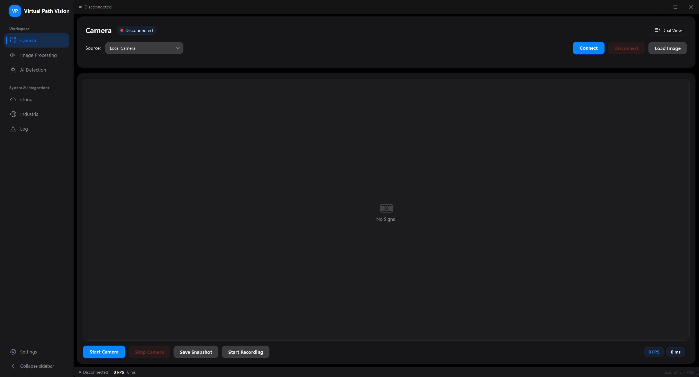
  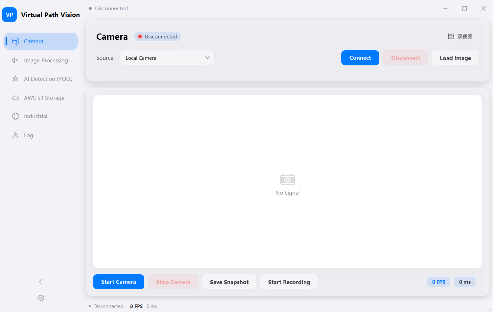
</p>

---

## Features

- **Dual Source** – Local USB camera or network IP camera (RTSP / MJPEG over HTTP)
- **Face Detection** – OpenCV 5 DNN detector (YuNet ONNX) drawing bounding boxes plus 5 facial landmarks and a confidence score
- **11 Processing Modes** – Canny, Sobel, Laplacian, Binary, Contour, QR/Barcode, Color Detection, Template Matching, Shape Detection, Feature Matching, Enhancement
- **QR / Barcode** – Real-time decoding of QR codes and 1D barcodes (EAN/UPC/Code128/Code39) with on-screen result display
- **Color Detection** – HSV-based detection with 9 preset colors, object counting, and click-to-pick sampling directly from the live image
- **Template Matching** – Locate a template image in the live feed with a match score
- **Shape Detection** – Classify objects into circles, rectangles, triangles, pentagons and polygons with per-type statistics
- **Feature Matching** – ORB keypoint matching with RANSAC homography, robust to rotation and scale changes
- **Enhancement** – CLAHE histogram equalization and unsharp masking for low-contrast scenes
- **Video Recording** – Record processed video to AVI files with one click
- **Screenshot** – Save the current frame as a PNG image
- **Network Camera** – Connect to phone cameras via IP Webcam apps
- **i18n Support** – Built-in English and Chinese, switchable at runtime
- **Light / Dark Themes** – Apple-style card UI with runtime theme switch (incl. *Follow system*) and a collapsible sidebar
- **AI Active Perception** – YOLO object detection, Kalman multi-object tracking and a digital-twin overlay (you supply the `.onnx` model; none is bundled)
- **AWS Cloud** – S3 screenshot upload, IoT Core telemetry and Lambda invocation
- **Industrial Connectivity** – Modbus TCP, OPC UA, serial / TCP barcode scanners and work-report export
- **Responsive Layout** – panels adapt and stack on narrow windows; crisp on 2K/4K displays (PerMonitorV2 DPI)
- **Image Analysis** – Load static images and apply the full processing pipeline
- **Real-time Stats** – FPS counter, processing time, face/contour counts

---

## Processing Modes

All screenshots below are produced by the app itself using the bundled test scene `TestImages/test_scene.png`.

<table>
  <tr>
    <td align="center"><b>Canny Edge</b><br/>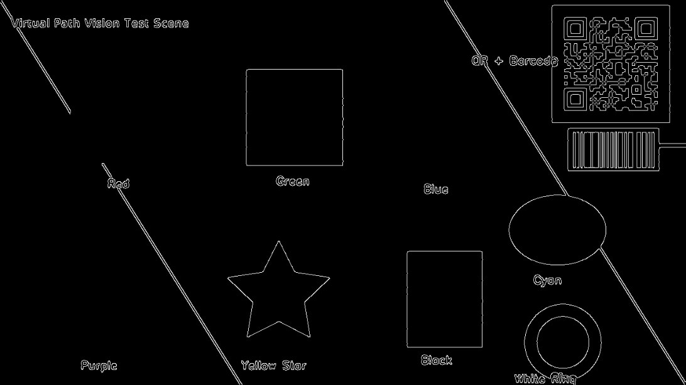</td>
    <td align="center"><b>Contour Detection</b><br/>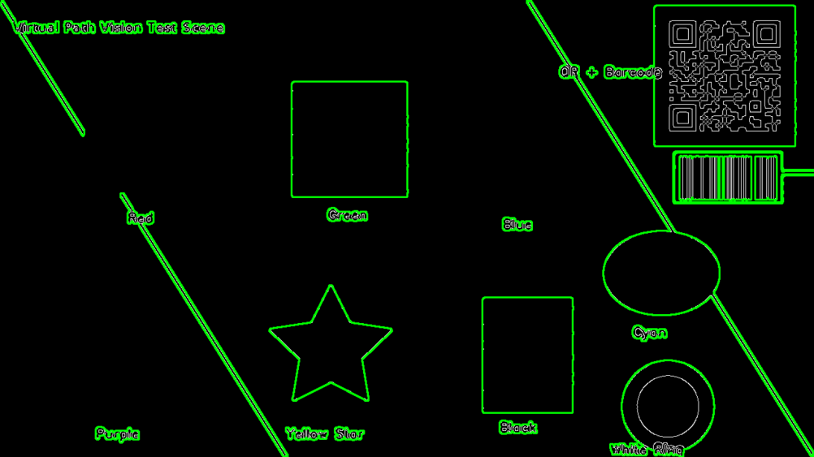</td>
  </tr>
  <tr>
    <td align="center"><b>Binary Threshold</b><br/>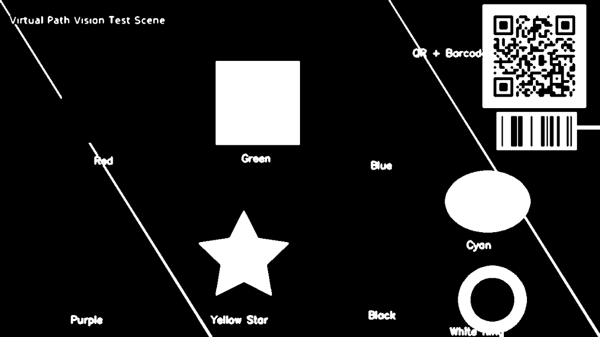</td>
    <td align="center"><b>Shape Detection</b><br/>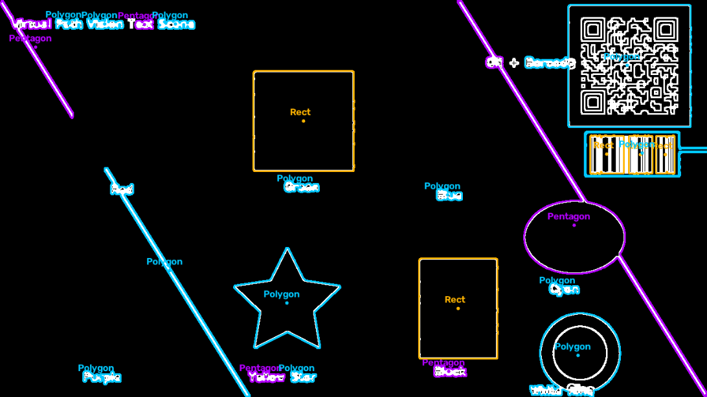</td>
  </tr>
  <tr>
    <td align="center"><b>Color Detection (Red)</b><br/>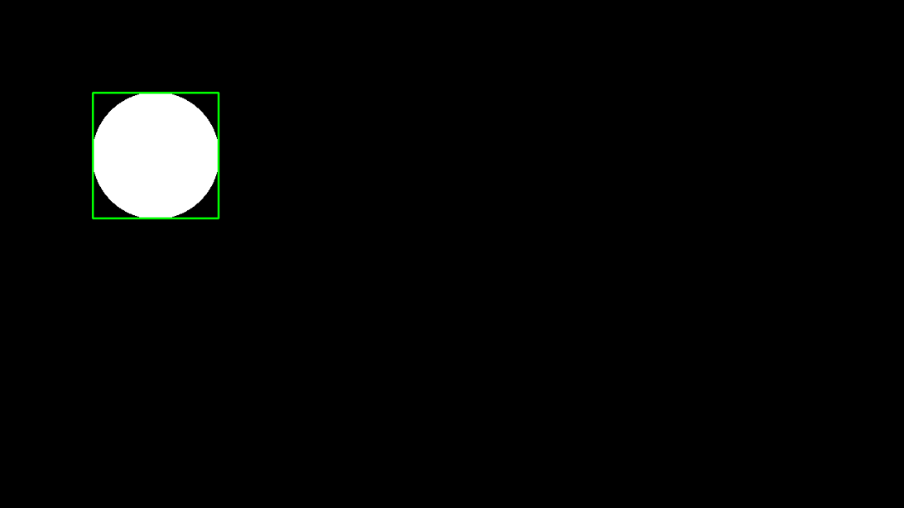</td>
    <td align="center"><b>QR / Barcode</b><br/>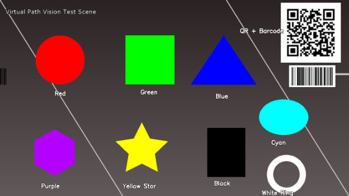</td>
  </tr>
  <tr>
    <td align="center"><b>Template Matching</b><br/>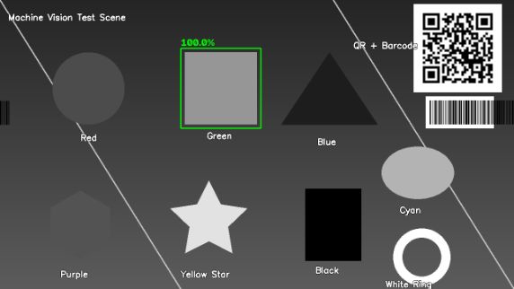</td>
    <td align="center"><b>Feature Matching (ORB)</b><br/>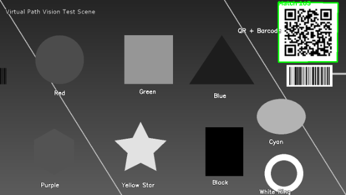</td>
  </tr>
  <tr>
    <td align="center"><b>Enhancement (CLAHE + Sharpen)</b><br/>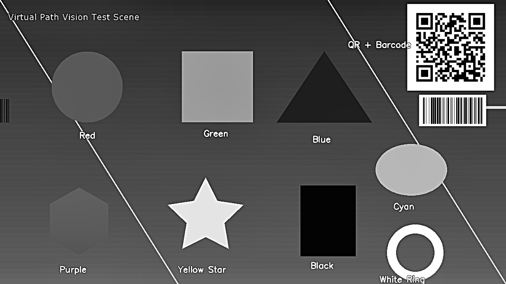</td>
    <td align="center"><b>Face Detection</b><br/>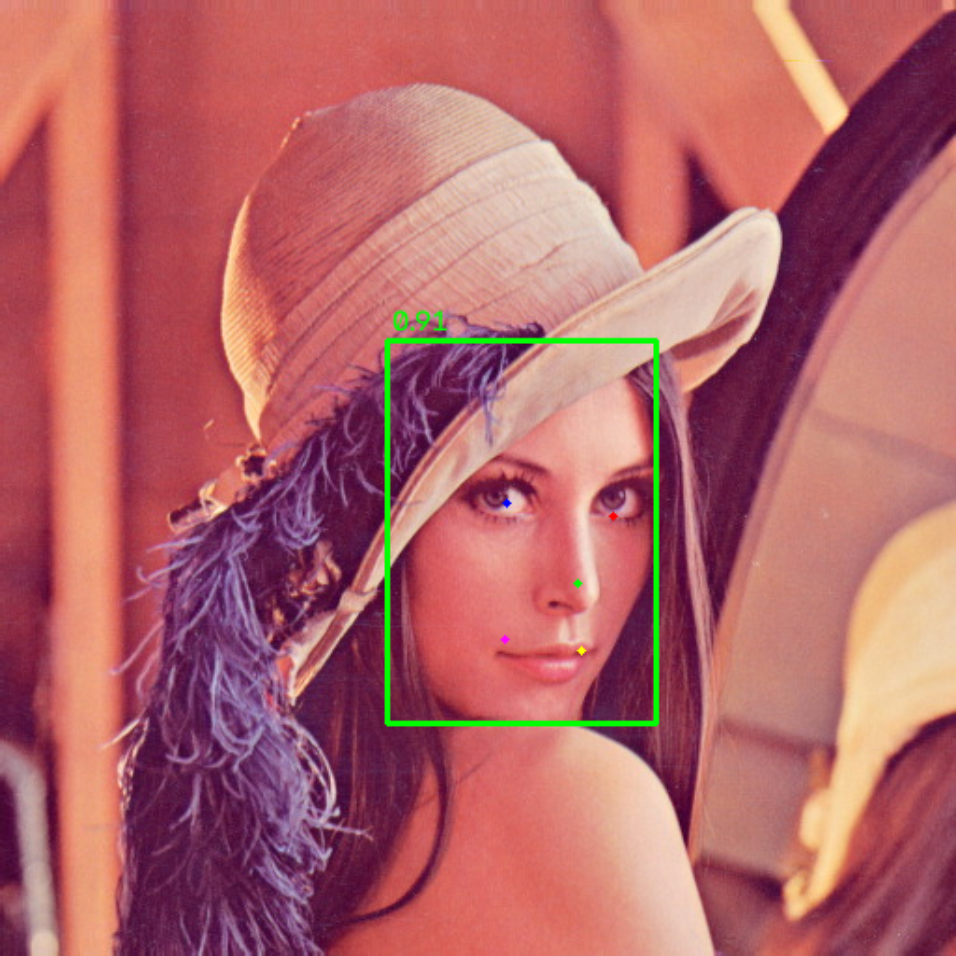</td>
  </tr>
</table>

---

## How It Works

1. **Select Source** – Choose "Local Camera", "Network Stream", or "File Replay"
2. **Configure** – For network, enter the IP address and port; for replay, pick a file with "Browse..."
3. **Connect** – Establish the video stream connection or start replaying
4. **Choose Mode** – Pick one of 11 processing algorithms
5. **Process** – Real-time processing and face detection, with FPS and timing stats
6. **Adjust** – Fine-tune Canny thresholds and re-apply (Canny / Contour modes)
7. **Scan / Detect / Match** – Point the camera at a QR code, colored object, shape, or a loaded template
8. **Save** – Take screenshots or record video at any time
9. **Load Image** – Offline analysis from image files

All processing runs asynchronously on a background thread, keeping the UI responsive.

---

## Using Your Phone as Camera

1. Install **IP Webcam** (Android) or a similar app on your phone
2. Make sure the phone and PC are on the same Wi-Fi network
3. Launch the app and note the URL (e.g., `http://192.168.1.100:8080/video`)
4. In this application:
   - Select **"Network Stream"** as the source
   - Enter the IP and port
   - Click **Connect**

The app automatically constructs the MJPEG URL and starts streaming.

---

## Tuning with Replayed Footage

Line defects are often hard to reproduce on demand; replaying a recording is the fastest way to pin down thresholds.

1. Select **"File Replay"** as the source
2. Click **"Browse..."** and pick a recording (mp4 / avi / mkv / mov / wmv / m4v, or an image-sequence directory)
3. Optionally adjust:
   - **FPS** – replay pacing. Left empty, the recording's own frame rate is used. 0 means no throttling (plays as fast as possible; rarely what you want)
   - **Loop** – tick to restart from the beginning at the end of the file
4. Click **Connect**. The panel shows `current / total` frames plus a progress bar

Replay feeds the exact same processing pipeline as live capture, so detection modes, thresholds, recording, and screenshots behave identically.

> Replay needs no external service. To reproduce the "3D engine as virtual camera" setup instead, use "Network Stream" with host `127.0.0.1` and the engine's port (e.g. 8080).

---

## Project Structure

```
├── VirtualPathVision/               # Application project
│   ├── App.xaml / App.xaml.cs       # Application entry, DI container, global exception handling
│   ├── MainWindow.xaml / .cs        # Main UI, navigation and event orchestration
│   ├── SettingsWindow.xaml / .cs    # Settings dialog (language + theme)
│   ├── ThemeService.cs              # Light / Dark / System theme switching
│   ├── TranslationService.cs        # i18n singleton with INotifyPropertyChanged
│   ├── UserSettings.cs              # Thread-safe, atomic reader/writer for user_settings.json
│   ├── AppConfig.cs                 # Typed binding for the AI / AWS config sections
│   ├── AppLogger.cs                 # Bounded logging service (singleton, UI-thread marshalled)
│   ├── app.manifest                 # PerMonitorV2 DPI awareness
│   ├── appsettings.json             # Industrial / AI / AWS parameters (read once at startup)
│   ├── Resources/
│   │   ├── Strings.resx             # Chinese resource strings (fallback)
│   │   └── Strings.en.resx          # English resource strings
│   ├── Themes/
│   │   ├── LightTheme.xaml          # Apple-style light palette + control styles
│   │   └── DarkTheme.xaml           # Apple-style dark palette + control styles
│   ├── Views/                       # One UserControl per page
│   │   ├── CameraPanel.xaml / .cs   # Home: capture, preview, screenshot / record
│   │   ├── ProcessingPanel.xaml / .cs   # 11 processing modes + thresholds
│   │   ├── AIPanel.xaml / .cs       # YOLO detection, tracking, digital twin
│   │   ├── CloudPanel.xaml / .cs    # AWS S3 / IoT Core / Lambda
│   │   ├── IndustrialPanel.xaml / .cs   # Modbus / OPC UA / scanners / work report
│   │   └── LogPanel.xaml / .cs      # Application log
│   ├── AI/                          # Active perception, Kalman tracking, digital twin, defect rules
│   ├── Cloud/                       # S3Service, IoTService, LambdaClient
│   ├── Industrial/                  # Modbus, OPC UA, serial/TCP scanners, work-report store
│   ├── Components/                  # Capture + image-processing components
│   ├── Converters/                  # Value converters (log level → colour, …)
│   ├── face_detection_yunet_2023mar.onnx
│   └── haarcascade_frontalface_default.xml
├── TestImages/                      # Sample test images (scene, templates, face photo)
└── docs/images/                     # Screenshots used by this README
```

> **Note:** `haarcascade_frontalface_default.xml` is no longer used — face detection
> runs entirely on the YuNet DNN model. The file is kept only for reference.

### Key Architecture

| Component | Responsibility |
|-----------|----------------|
| `VideoCaptureComponent` | `VideoSourceType.LocalCamera` / `.NetworkStream`, auto-fallback APIs (DSHOW → MSMF → ANY), connection state machine |
| `ImageDisplayComponent` | Batched `Dispatcher.Invoke` for dual-image update |
| `ImageProcessingComponent` | 5 classic modes: Canny, Sobel, Laplacian, Binary Threshold, Contour Detection |
| `FaceDetectionComponent` | OpenCV 5 `FaceDetectorYN` (YuNet ONNX) — bounding box + 5 landmarks + confidence; degrades gracefully to "unavailable" if the model is missing |
| `BarcodeDetectionComponent` | ZXing.Net decoding of QR/DataMatrix/EAN/UPC/Code128/Code39, frame-throttled with result caching |
| `ColorDetectionComponent` | HSV `InRange` masks + morphology + contour counting for 9 preset colors, plus click-to-pick custom sampling |
| `TemplateMatchComponent` | `MatchTemplate` (CCoeffNormed) with threshold gating and score overlay |
| `ShapeDetectionComponent` | Canny + contour polygon approximation + circularity analysis, classifies circles/rects/triangles/pentagons/polygons; shares the Canny threshold sliders |
| `FeatureMatchComponent` | ORB keypoints + BFMatcher ratio test + RANSAC homography, draws perspective detection box |
| `EnhancementComponent` | CLAHE histogram equalization + unsharp masking |
| `RecordingComponent` | `VideoWriter`-based AVI recording with MJPG codec |
| `ThresholdParameterComponent` | Validates input and fires `OnThresholdsChanged` |
| `TranslationService` | `INotifyPropertyChanged` singleton, `ResourceManager`-backed, fires full refresh on culture switch |
| `AppLogger` | Singleton with INFO/WARN/ERROR levels; capped at 2000 entries and marshalled onto the UI thread so it is safe to call from the capture thread |

---

## Internationalization

- Default language is **English** (click **EN/中** in the title bar to switch to Chinese)
- All user-facing UI labels are managed via `.resx` resource files
- To add a new language: copy `Strings.en.resx`, rename to `Strings.xx.resx`, and translate the values

> **Note:** diagnostic log messages emitted by the drivers are still written in
> Chinese. They appear in the **Log** panel and are not translated yet.

---

## Requirements

- .NET 8 SDK (build only; the release package below is self-contained)
- Windows 10/11 with WPF support
- NuGet packages (restored automatically):
  - `OpenCvSharp5` – OpenCV 5 bindings
  - `OpenCvSharp5.runtime.win` – Native OpenCV binaries
  - `OpenCvSharp5.WpfExtensions` – `BitmapSource` conversion
  - `ZXing.Net` – QR code and barcode decoding
  - `AWSSDK.S3` / `AWSSDK.Lambda` / `AWSSDK.SimpleNotificationService` – AWS integration
  - `NModbus` / `OPCFoundation.NetStandard.Opc.Ua.*` – industrial protocols
  - `Microsoft.Data.Sqlite` – local work-report storage

### Configuration

`VirtualPathVision/appsettings.json` is read **once at startup** — editing it takes
effect after restarting the application. `user_settings.json` (written next to the
executable) persists UI preferences such as language, theme and sidebar state.

| Section | Keys |
|---------|------|
| `Industrial` | Modbus TCP, OPC UA, serial scanner, TCP scanner, work-report database |
| `AI` | YOLO model path, confidence / NMS thresholds, input size, trail settings |
| `AWS` | Region, S3 bucket, IoT endpoint + certificate paths, topic prefix, Lambda function |

---

## Getting Started

### Download (no build required)

Grab the latest self-contained package from [Releases](../../releases/latest):

1. Download `VirtualPathVision-win-x64-vX.Y.Z.zip`
2. Extract it to any folder
3. Run `VirtualPathVision.exe`

### Build from source

```bash
# Clone the repository
git clone https://github.com/virtual-path/virtual-path-vision.git
cd virtual-path-vision

# Restore and build
dotnet restore
dotnet build -c Release

# Run
dotnet run --project VirtualPathVision/VirtualPathVision.csproj
```

Or open `VirtualPathVision.sln` in Visual Studio 2022 and press **F5**.

### Try the bundled test images

Open `TestImages/` from the Load Image dialog:

| Image | What to test |
|-------|--------------|
| `test_scene.png` | All processing modes – edges, contours, shapes, colors, QR (`https://github.com/virtual-path/virtual-path-vision`) and barcode (`OPENCV5`) |
| `template_green.png` | Template Matching (green square, score ≈ 1.0) |
| `template_qr.png` | Feature Matching (texture-rich QR crop) |
| `face_lena.jpg` | Face Detection |

---

## Tech Stack

| Technology      | Description                     |
|-----------------|---------------------------------|
| `WPF`           | UI framework for Windows apps   |
| `OpenCvSharp5`  | .NET wrapper for OpenCV 5       |
| `AWS SDK v4`    | S3 / IoT / Lambda integration   |
| `ZXing.Net`     | QR code and barcode decoding    |
| `C#`            | Primary programming language    |
| `XAML`          | UI design and layout            |
| `.resx`         | Resource files for i18n         |

---

## Contributing

Contributions are welcome! Please read [CONTRIBUTING.md](CONTRIBUTING.md) and the
[Code of Conduct](CODE_OF_CONDUCT.md). Security issues should be reported per
[SECURITY.md](SECURITY.md).

---

## License

Released under the [GNU General Public License v3.0](LICENSE).
© 2026 xianshi3 and contributors.
